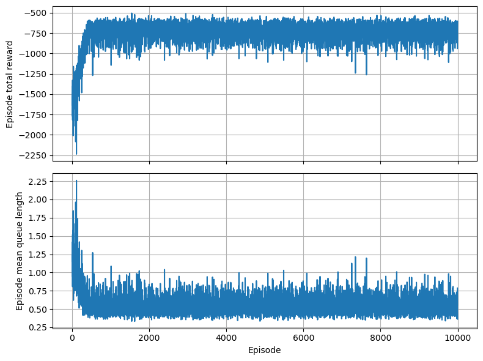
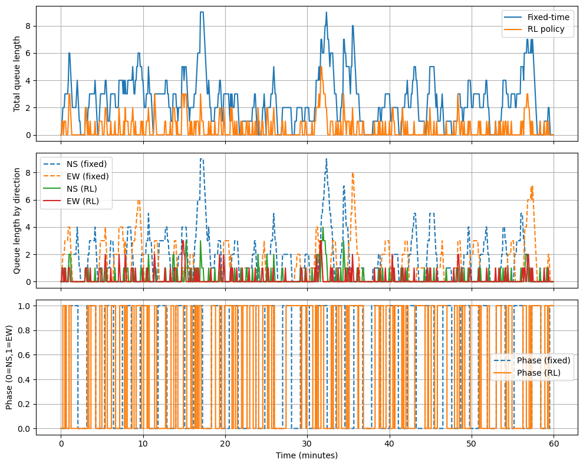
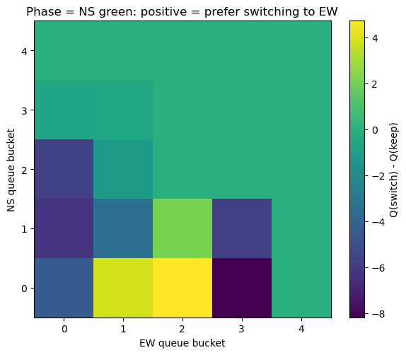

# 2025-Fall-Maching Learning Final Project
## AI 的未來與機器學習的基石：城市級智慧交通號誌總管

## 1. AI 的未來能力：20 年後的城市級智慧交通號誌總管

我關注的未來能力是：

> **讓 AI 以「城市級、多目標、即時協同」的方式，控制整個大都會區所有的交通號誌與相關設施，在數秒內重新調整整體配置，使交通系統在效率、安全、公平與環境影響之間取得最佳平衡。**

這個能力遠超過目前的「智慧號誌」或「自適應紅綠燈」系統。現在的系統通常具有以下限制：

- 控制範圍局限於**單一路口或局部幾個路口**，缺乏全城協調。
- 目標函數通常單一，例如「減少平均延誤」或「提升某一路段通行量」，較少同時兼顧：
  - 行車時間與可靠度（通勤時間可預測、變異小）
  - 公車與大眾運輸準點率（公車優先）
  - 行人與騎士安全（行人號誌、右轉衝突）
  - 緊急車輛（救護車、消防車）快速通行
  - 碳排放與空污（減少怠速與走走停停）
  - 區域之間的**公平性**（不能只讓市中心順暢，郊區永遠排隊）

我想像的 20 年後系統具有以下特徵：

1. **全城即時觀測與決策**  
   - 系統能夠即時獲取整個都市路網上所有車輛、行人、機車、公車與腳踏車的動態資訊。
   - AI 以數秒為單位更新整體控制策略，包含：
     - 每個路口的號誌相位配置與綠燈長度
     - 公車專用時相、行人專用時相
     - 匝道儀控、可變車道、可變速限等措施

2. **多目標與多時間尺度的最佳化**  
   - 短期目標：減少當下的平均延誤與排隊長度。
   - 中期目標：維持公車準點、保證緊急車輛通行時間上限。
   - 長期目標：降低整體碳排與事故風險，兼顧不同區域居民的通勤負擔。

3. **與車聯網及其他系統的協同**  
   - 車輛透過車聯網 (V2I, V2V) 向號誌與路側單元報告位置與預計路徑。
   - AI 根據事件（車禍、道路施工、演唱會或比賽）快速重新配置全城號誌策略。

這樣的系統若能實現，對人類社會的影響包括：

- 減少每日大量浪費在交通堵塞中的時間與燃油。
- 改善空氣品質與碳排放，對環境有實質貢獻。
- 降低車禍與行人事故，提升整體安全。
- 讓通勤的時間與風險更可預測，改善市民生活品質。

目前要達成上述「城市級、多目標、秒級更新」的能力，在資料蒐集、模型設計與計算複雜度上都仍有明顯缺口，因此是我認為 20 年後 AI 才有機會完整實現的能力。

---

## 2. 所需的成分與資源（Ingredients）

若要實現上述城市級智慧交通號誌總管，至少需要以下幾類成分。

### 2.1 資料 Data

1. **即時交通流量資料**
   - 每個路口各方向的：
     - 車流量（通過數、到達數）
     - 排隊長度、平均速度
     - 車種比例（小客車、機車、公車、貨車）
   - 行人與自行車的穿越量與等候時間。
   - 這些資料需要高時間解析度（例如每 5–10 秒更新）。

2. **車輛端資料**
   - 來自車載 GPS 或行車電腦的即時位置與速度。
   - 車輛預測路徑（導航資訊）或乘客量（對公車更重要）。
   - 透過 V2X (Vehicle-to-Everything) 回報給基礎設施。

3. **環境與事件資訊**
   - 天氣狀態（雨、霧、強風）、白天/夜晚。
   - 道路施工、事故、臨時封路的通報。
   - 大型活動（演唱會、比賽、遊行）帶來的流量突變。

4. **標註與歷史績效資料**
   - 不同號誌策略下的觀察結果：
     - 平均旅行時間、平均延誤
     - 排隊長度分佈
     - 緊急車輛的通行時間
     - 事故與險象環生事件（near-miss）的統計
   - 這些資料可以用作監督式學習、離線評估與策略初始化。

同時，資料蒐集必須兼顧**隱私保護與安全**，例如進行匿名化與聚合處理，避免追蹤到個別人或車輛的身分。

---

### 2.2 工具 Tools（數學與機器學習）

1. **圖結構建模與圖神經網路 (Graph / GNN)**  
   - 城市路網可以表示為圖：節點為路口，邊為道路。
   - GNN 可以在圖上學習：
     - 不同路口之間的互相影響（上游壅塞如何傳導到下游）。
     - 某些關鍵節點或瓶頸的結構特性。
   - 作為強化學習的「狀態表示 (state representation)」。

2. **強化學習與多智能體強化學習 (RL / MARL)**  
   - 每一個路口可以被視為一個 agent，或一個中央 agent 控制整張網路。
   - 狀態：全城或局部的交通狀態（排隊長度、流量、事件）。
   - 動作：調整號誌相位與綠燈秒數，以及特殊時相（例如行人專用、公車優先）。
   - 回饋 (reward) 可能包括：
     - 平均延誤、排隊長度的負值
     - 事故或違規狀況的巨大懲罰
     - 緊急車輛通行時間的負值
   - 多智能體設定下，需要考慮 agent 之間的協調與穩定性。

3. **時間序列預測與序列模型**
   - 使用 RNN、Temporal CNN 或 Transformer 來預測未來幾分鐘各路段的流量變化。
   - 讓控制策略可以「提前」調整，而不是純反應式。

4. **最佳化與控制理論**
   - 多目標最佳化：在效率、安全、環境、公平性間權衡。
   - 可結合：
     - 排隊理論（queueing theory）
     - 傳統號誌控制（例如 Webster formula、固定時制設計）
     - 最佳控制 (optimal control) 與 Model Predictive Control (MPC)

---

### 2.3 硬體與環境 Hardware / Environment

1. **感測與邊緣運算設備**
   - 每個路口的攝影機、雷達或其他感測器。
   - 路側邊緣運算設備 (edge devices) 負責即時偵測與初步資料處理。

2. **高速且可靠的通訊網路**
   - 5G 或專用光纖，確保資料可以在低延遲下送往中央伺服器與其他路口。
   - 支援車聯網 (V2X) 的基礎建設。

3. **大型雲端或資料中心**
   - 用於訓練 GNN、RL 等大型模型。
   - 進行全城尺度的交通模擬與策略分析。

4. **交通模擬環境**
   - 微觀交通模擬器（例如 SUMO、Aimsun 等）用來：
     - 進行策略的離線訓練與測試。
     - 建立 simulation-to-real 的橋樑。

---

### 2.4 學習架構 (Learning Setup)

1. **監督式學習作為初始化**
   - 使用歷史資料學習「人類工程師或既有系統在各種情境下的號誌策略」。
   - 讓 AI 先模仿現有合理策略，而不是從完全隨機開始。

2. **在模擬環境中進行強化學習**
   - 使用 RL 或 MARL 在交通模擬器中反覆試驗。
   - 探索明顯優於傳統策略的新方案，但不直接在真實城市冒險。

3. **Simulation-to-Real 與線上微調**
   - 在模擬學到的策略作為初始政策，在真實環境中進行保守的微調。
   - 採用安全約束 (safe RL)，避免在真實系統中做出極端行為。

4. **結合 self-supervised / meta-learning / RLHF**
   - self-supervised：從大量未標註交通資料中學習更好的狀態表示。
   - meta-learning：讓模型可快速遷移到新城市或新路網。
   - RLHF 或人類審查：避免 AI 走向「看起來數字很好」但在公平或安全上不可接受的策略。

---

## 3. 涉及的機器學習類型

整體來說，這個未來能力會是「多種學習方法的組合」，但主軸仍是**強化學習**。

### 3.1 強化學習（主軸）

- **為什麼需要 RL？**  
  號誌控制是一個典型的序列決策問題：
  - 系統必須根據當下狀態選擇動作（相位與綠燈長度）。
  - 動作會影響未來的交通狀態（排隊長度、旅行時間）。
  - 回饋（整體延誤、事故、緊急車輛通行）通常是延遲出現的。
- **資料來源與目標訊號**  
  - 資料來源：來自感測器與模擬器的交通狀態序列。
  - 目標訊號：由延誤、排隊長度、事故與特定約束構成的 reward 函數。
  - 學習過程中，模型透過與「環境」互動，不是單純對固定訓練集做擬合。

### 3.2 監督式學習（輔助）

- 用途：
  - 預測未來幾分鐘各路段交通流量。
  - 車輛到達時間預測、公車準點性預測。
  - 事故或異常事件偵測（從影像或感測器資料）。
- 資料來源：
  - 歷史交通記錄與標註好的事件資料。
- 目標訊號：
  - 例如「未來 5 分鐘之內的車流量」的真實值，或「是否為事故」的標籤。

### 3.3 非監督式學習（輔助）

- 用途：
  - 分群不同的交通型態（尖峰時段、週末、雨天、活動日）。
  - 在沒有明確標籤的情況下，學習路網的隱含結構。
- 這些結果可以用來：
  - 設計場景特定的控制策略。
  - 作為 RL 或監督式模型的先驗資訊。

總結來說，城市級智慧交通號誌總管的實現會是「**強化學習為核心，搭配監督式與非監督式學習提供預測與表示**」的複合系統。

---

## 4. 第一步的可實作模型問題 (Solvable Model Problem)

真實系統的規模與複雜度遠超過目前可實作的範圍。為了將大問題化成可操作的數學學習任務，我設計了一個**單一路口、兩個相位的簡化強化學習模型問題**。

### 4.1 問題設計：單一路口 Q-learning 模型

**對應到最終目標的關係**

- 真實系統：成千上萬個路口、複雜的車種與路網結構。
- 簡化模型：只考慮一個十字路口，東西向與南北向兩個相位。

透過這個簡化模型，我可以先在非常受控的設定下理解：

- 如何設計狀態、動作與 reward。
- RL 在號誌控制這類序列決策問題中的行為與收斂特性。
- 即使在單一路口，控制也已經具有延遲回饋與 trade-off。

**具體定義**

- **環境設定**
  - 一個十字路口，有兩個交通相位：
    1. 相位 A：南北直行／左轉放行。
    2. 相位 B：東西直行／左轉放行。
  - 每個方向的車流到達可簡化為柏松過程，速率為 \(\lambda_{\text{NS}}\) 與 \(\lambda_{\text{EW}}\)。

- **狀態 (state)**
  - 在時間步 \(t\)，狀態 \(s_t\) 包含：
    - 各方向排隊車輛數量（可離散化，例如 \(\{0, 1\text{–}5, 6\text{–}10, >10\}\)）。
    - 目前號誌相位（A 或 B）。

- **動作 (action)**
  - Agent 在每個時間步可以選擇：
    1. 維持目前相位不變。
    2. 切換到另一個相位（切換時可加上黃燈或 all-red 的固定時間）。

- **時間更新**
  - 每個時間步代表 \(\Delta t\) 秒（例如 5 秒）。
  - 在時間步內：
    - 新車輛依柏松分佈到達。
    - 綠燈方向的排隊車輛按固定車頭時距通過路口。

- **reward 設計**
  - 在第 $t$ 步，給予 reward：
    $$
    r_t = -\left( \sum_{\text{方向}} \text{queue\_length}_{t} \right) - \alpha \cdot \mathbf{1}\{\text{切換相位}\},
    $$
    其中 \(\alpha > 0\) 是切換成本（代表黃燈與安全考量）。
  - 目標是最大化長期累積折扣回饋：
    $$
    \mathbb{E}\left[\sum_{t=0}^{\infty} \gamma^t r_t \right]
    $$
    這等價於最小化排隊長度與不必要的相位切換。

---

### 4.2 模型與方法：Tabular Q-learning

在這個簡化問題中，為了讓實作與分析更清楚，我選擇使用 **Tabular Q-learning** 作為主要方法。

- **理由**
  - 狀態空間經過適當離散化後規模不算太大，表格式 Q-learning 可以直接對 \((s, a)\) 配對更新。
  - 模型結構簡單，利於理解強化學習的基本機制與收斂行為。
  - 若未來要擴展到更大狀態空間，可以自然過渡到 DQN 等深度 RL 方法。

- **Q-learning 更新式**
  - 在每次互動中，經歷狀態轉移：
    $$
    (s_t, a_t, r_t, s_{t+1})
    $$
  - Q-learning 的更新為：
    $$
    Q(s_t, a_t) \leftarrow Q(s_t, a_t) + \eta \left[ r_t + \gamma \max_{a'} Q(s_{t+1}, a') - Q(s_t, a_t) \right],
    $$
    其中：
    - \(\eta\)：學習率
    - \(\gamma\)：折扣因子
    - \(Q(s, a)\)：狀態–動作價值函數。

- **行為策略**
  - 採用 \(\varepsilon\)-greedy：
    - 以機率 \(1-\varepsilon\) 選擇目前 Q 值最大的動作。
    - 以機率 \(\varepsilon\) 隨機選擇其他動作，以保留探索能力。
  - \(\varepsilon\) 可隨時間遞減，使後期收斂到較穩定策略。

---

### 4.3 實作與結果

#### 4.3.1 環境實作細節

我以 Python 撰寫一個極簡但可重現的交通號誌模擬環境 `SingleIntersectionEnv`，主要設定如下：

- **時間尺度**
  - 每個 time-step 長度為 \(\Delta t = 5\) 秒 (`dt = 5.0`)。
  - 一個 episode 對應一小時模擬時間：`episode_duration = 3600` 秒，因此每個 episode 包含 \(3600 / 5 = 720\) 個 time-step。

- **車流模型**
  - 南北向與東西向的到達流量皆假設為獨立的柏松過程：
    \[
    N_{\text{NS}} \sim \text{Poisson}(\lambda_{\text{NS}} \Delta t),\quad
    N_{\text{EW}} \sim \text{Poisson}(\lambda_{\text{EW}} \Delta t),
    \]
    其中在最終實驗中設定 \(\lambda_{\text{NS}} = \lambda_{\text{EW}} = 0.05\) 車/秒 (`lambda_ns = lambda_ew = 0.05`)。
  - 在這個設定下，每個時間步期望到達車輛數約為 \(0.05 \times 5 = 0.25\) 輛（每個方向），整體約為 0.5 輛/step，低於服務能力，因此系統理論上是**穩定**的。

- **通過能力與 queue 限制**
  - 每個 time-step 中，只有「當前綠燈的方向」可以通行，且最多通過 `discharge_rate = 1` 輛車。
  - 每個方向的排隊長度上限設為 `max_queue = 30`，避免在數值上爆炸。

- **狀態離散化**
  - 目前的號誌相位：`phase ∈ {0, 1}`，0 代表南北向綠燈，1 代表東西向綠燈。
  - 各方向排隊長度 \(q_{\text{NS}}, q_{\text{EW}}\) 透過函數 `_bucket(q)` 離散成 5 個 bucket：
    - bucket 0：\(q \le 0\)
    - bucket 1：\(1 \le q \le 5\)
    - bucket 2：\(6 \le q \le 10\)
    - bucket 3：\(11 \le q \le 20\)
    - bucket 4：\(q > 20\)
  - 因此整體 state 空間大小為
    \[
    2 \text{(phase)} \times 5 \text{(NS bucket)} \times 5 \text{(EW bucket)} = 50。
    \]

- **動作空間**
  - `action = 0`：維持目前相位不變。
  - `action = 1`：切換到另一個相位（隱含包含黃燈 / all-red 的固定時間成本）。

- **reward 設計**
  - 在每個 time-step \(t\)，根據當前排隊長度與是否切換相位給予 reward：
    \[
    r_t = -\bigl(q_{\text{NS}, t} + q_{\text{EW}, t}\bigr) - \text{switch\_penalty} \cdot \mathbf{1}\{\text{當步切換相位}\},
    \]
    其中 `switch_penalty = 2.0`。  
    這表示系統同時希望：
    - 盡量降低總排隊長度；
    - 避免沒有必要的頻繁切換號誌相位。

#### 4.3.2 Q-learning 訓練設定與學習曲線

在上述環境上，我使用 Tabular Q-learning 進行訓練。主要超參數如下：

- 折扣因子：\(\gamma = 0.99\)
- 學習率：\(\alpha = 0.1\)
- 探索策略：\(\varepsilon\)-greedy
  - 初始 \(\varepsilon_{\text{start}} = 1.0\)
  - 最低 \(\varepsilon_{\text{end}} = 0.05\)
  - 在前 400 個 episodes 線性衰減到 0.05（`epsilon_decay_episodes = 400`）
- 訓練總長度：`n_episodes = 10000`

在每個 episode 結束時，我紀錄：

- 該 episode 的**總回饋**（所有 time-steps 的 reward 線性加總）。
- 該 episode 的**平均排隊長度**（所有 time-steps 的 \((q_{\text{NS}} + q_{\text{EW}})\) 取平均）。

圖 1 Q-learning 訓練過程中 episode total reward 與平均排隊長度
 

圖 1 顯示訓練過程中，episode 總回饋與平均排隊長度隨 episode 的變化情形（上圖為 total reward，下圖為 mean queue）：

- 在訓練初期（前幾百個 episodes），總回饋約落在 \(-2000\) 左右，平均排隊長度約在 2 輛上下，且波動較大。
- 隨著訓練進行，agent 逐漸學會根據 queue 狀態調整相位：
  - **總回饋提升到約 \(-700\)** 的穩定區間；
  - **平均排隊長度下降並穩定在約 0.5–0.8 輛**。
- 這代表 Q-learning 已經收斂到一個在本環境下效果良好的策略：路口大部分時間只會有零星幾輛車在等待。

#### 4.3.3 與固定時制基準策略的比較

為了評估 RL 策略是否真的優於傳統做法，我實作了一個簡單的**固定時制 (fixed-time) 基準策略**：

- 仍然假設只有兩個相位（NS 綠燈與 EW 綠燈）。
- 在 fixed-time 策略下，不論當前 queue 狀態為何，號誌皆以固定週期輪替：
  - 每 12 個 time-steps（60 秒）切換一次相位（`phase_duration_steps = 12`）。

在相同環境參數與隨機種子的前提下，分別讓：

- Q-learning 訓練好的 agent，以 greedy policy（對每個 state 選擇 \(Q(s, a)\) 最大的動作）運行 100 個 episodes；
- 固定時制策略運行 100 個 episodes。

兩種策略的統計結果如下：

- **RL 策略（Q-learning）**
  - 平均總回饋：\(\text{avg\_total\_reward} \approx -669.8\)
  - 回饋標準差：\(\text{std\_total\_reward} \approx 67.8\)
  - 平均排隊長度：\(\text{avg\_mean\_queue} \approx 0.51\)
  - 排隊長度標準差：\(\text{std\_mean\_queue} \approx 0.08\)

- **固定時制策略**
  - 平均總回饋：\(\text{avg\_total\_reward} \approx -1886.9\)
  - 回饋標準差：\(\text{std\_total\_reward} \approx 178.9\)
  - 平均排隊長度：\(\text{avg\_mean\_queue} \approx 2.47\)
  - 排隊長度標準差：\(\text{std\_mean\_queue} \approx 0.25\)

由於 reward 的定義為「負的排隊長度再加上切相位懲罰」，數值越接近 0 代表狀況越好。上述結果可以解讀為：

- 在相同隨機車流下，RL 策略將平均排隊長度從約 \(2.47\) 輛**降到約 \(0.51\) 輛**，約減少了 **80%**。
- 對應的總回饋由 \(-1886.9\) 提升到 \(-669.8\)，代表整體「壅塞 + 切換成本」大約**降低了六到七成**。
- 且 RL 的標準差較小，表示在不同 episodes 下表現更穩定，不容易出現極端壅塞情況。

#### 4.3.4 時間序列視覺化：同一路口下 RL 與固定時制的差異

除了整體統計之外，我也針對同一組隨機車流（固定亂數種子）各跑一次 RL 策略與固定時制策略，並記錄整個一小時內的：

- 總排隊長度 \(q_{\text{NS}} + q_{\text{EW}}\)；
- 南北/東西兩個方向各自的排隊長度；
- 號誌相位（0 = NS 綠燈，1 = EW 綠燈）。

圖 2 單一路口中 RL 與固定時制策略之比較（時間序列）
 

圖 2 顯示這個代表性 episode 的時間序列：

1. **總排隊長度（圖 2(a)）**  
   - 固定時制策略（藍線）的總排隊長度經常上升到 6–9 輛，且需要數個 time-steps 才慢慢消化。
   - RL 策略（橘線）大部分時間維持在 0–2 輛之間，偶爾有短暫的尖峰，但很快被清空。

2. **分方向排隊長度（圖 2(b)）**  
   - 固定時制下，南北與東西兩個方向的 queue 經常同時偏高，例如某些時段 NS 已累積 6–8 輛，而 EW 仍有 2–4 輛。
   - RL 策略下，兩方向的 queue 幾乎都在 0–1 輛上下，很少超過 2 輛，表示系統能夠在短時間內處理完新到達的車流。

3. **號誌相位變化（圖 2(c)）**  
   - 固定時制策略的 phase 呈現規律的方波型態，每 60 秒切換一次相位，完全不考慮當下的排隊狀態。
   - RL 策略的 phase 則會根據 queue 狀態動態調整：有時在某一相位停留較久（例如該方向比較塞），有時則快速切回另一相位（當目前綠燈方向幾乎沒有車時）。

這組時間序列圖讓人可以直觀地看到：**在同一段實際車流下，RL 策略確實讓路口的排隊大幅減少，並以更「因時制宜」的方式切換號誌。**

#### 4.3.5 策略結構視覺化：Q 值差異熱圖

圖 3 phase = NS 綠燈時 Q(switch) − Q(keep) 的熱圖
 

最後，為了理解 RL 到底學到了什麼樣的「決策規則」，我將在「南北向綠燈 (phase = 0)」時，不同佇列組合下的
\[
Q_{\text{switch}}(s) - Q_{\text{keep}}(s)
\]
畫成一張 \(5\times 5\) 的熱圖（圖 3）。

- 橫軸為東西向 queue bucket，縱軸為南北向 queue bucket：
  - 0：沒有車
  - 1：1–5 輛
  - 2：6–10 輛
  - 3：11–20 輛
  - 4：超過 20 輛（在本實驗幾乎不會出現）
- 顏色代表在該狀態下「切換相位」相對於「維持相位」的優劣：
  - 顏色 **> 0（偏黃/綠）**：`Q(switch) > Q(keep)`，agent 傾向**立刻切換給 EW**。
  - 顏色 **< 0（偏藍/紫）**：`Q(switch) < Q(keep)`，agent 傾向**繼續讓 NS 綠燈**。

從圖 3 可以觀察到：

- 當南北向幾乎沒有車，而東西向已有數輛在排隊時（例如 NS bucket = 0、EW bucket = 1–2），熱圖呈現明顯正值，代表 agent 會「趕快切給 EW」。
- 當南北向的 queue 比東西向嚴重時（例如 NS bucket = 1–2、EW bucket = 0–1），顏色轉為負值，代表 agent 選擇維持 NS 綠燈，優先消化較長的隊伍。
- 在 bucket 3–4 的區域顏色接近 0，表示在當前流量設定下這些狀態幾乎不會被訪問到，因而 Q 值差異不大，而不是 agent 認為「切與不切都一樣好」。

整體而言，可以用一句話概括這個策略結構：

> **「哪個方向目前比較塞，就先給哪個方向綠燈；如果目前綠燈方向幾乎沒車而另一方向開始排隊，就及時切換相位。」**

這種以「相對佇列長度」為核心的決策規則，和人類交通工程師在設計自適應號誌時的直覺相當接近，也說明即使在僅有 queue 長度與相位資訊的極簡狀態表示下，Tabular Q-learning 仍能從反覆模擬中學到合理的號誌控制策略。

---

### 4.4 討論：從簡化模型看到的困難與關鍵

透過這個簡化的單一路口 Q-learning 實作，我得到幾個比較具體的觀察，而不只是抽象地「RL 可以做號誌控制」。

1. **系統本身的「可控性」比演算法更重要**

   在一開始的實驗中，我曾使用較大的到達率設定 \(\lambda_{\text{NS}} = \lambda_{\text{EW}} = 0.25\) 車/秒，其他參數不變（每步最多放行 1 輛，\(\Delta t = 5\) 秒）。  
   這表示每個方向在每個 time-step 的期望到達量約為 \(0.25 \times 5 = 1.25\) 輛，而服務能力只有 1 輛/step，單邊 traffic intensity 大於 1，系統從排隊理論的角度就是**必然爆炸**的。

   實際訓練結果也印證這一點：不論怎麼調整超參數，queue 都會黏在上限附近，reward 曲線只是在不同的「很爛」區間震盪。  
   這提醒我：**強化學習不是魔法**，如果物理上系統就無法穩定（供給 < 需求），再好的 policy 也救不了；在設計 RL 問題時，先檢查系統本身是否存在合理的穩態，比盲目調超參數更關鍵。

2. **reward 設計直接塑造了策略的行為風格**

   在本實驗的 reward 中，我只放了兩個項目：
   - 總排隊長度 \(q_{\text{NS}} + q_{\text{EW}}\) 的負值；
   - 每次切換相位的固定懲罰 `switch_penalty = 2.0`。

   這個簡單的設計已經足以讓 agent 學到「**避免不必要的頻繁切換**」：如果把 switch penalty 降得太低，RL 會傾向瘋狂切換以「搶最後那一輛車」，反而在實務上非常危險；相反地，懲罰太大又會導致 agent 過度保守。  
   真實城市系統若要加入安全、公車優先、行人等需求，reward 將變成多目標的權重組合，如何避免學到「看起來數字很好但非常不公平」的策略會是一個更困難的問題。

3. **延遲回饋與 credit assignment 的難題在單一路口就已經出現**

   某些決策（例如在某一時刻多待幾個 step 不切相位）可能要經過數十個 time-steps 才會反映在 queue 爆炸或順利消化上。  
   即使在只有 50 個 state 的 tabular 設定中，Q-learning 仍需要數千個 episodes 才能穩定，這凸顯了序列決策問題的 credit assignment 困難；如果放大到整個城市，這個困難只會加劇，不會消失。

4. **探索與穩定性的 trade-off 在交通應用中特別敏感**

   在模擬環境裡，我可以放心讓 \(\varepsilon\)-greedy 從 1.0 線性衰退到 0.05，前期 agent 大量嘗試「怪異」的切換行為，最多只是造成模擬中的壅塞。但在真實城市中，這種探索會直接帶來實際的塞車與安全風險。  
   因此，若要把這類 RL 策略搬到真實世界，必須考慮：
   - 在模擬中盡可能完成大部分探索（offline RL / batch RL）；
   - 在真實系統中以「保守微調」的方式進行有限探索（safe RL），並設定明確的 safety constraint。

5. **從單一路口到城市級系統的鴻溝**

   本報告的 model problem 雖然只是一個小小的十字路口，但已經包含：
   - 狀態–動作–回饋的數學定義；
   - 延遲回饋、探索、credit assignment 等 RL 核心議題；
   - 可以用程式實際訓練、畫出 queue／phase 的時間序列、看出 strategy heatmap。

   若要走向真正的「城市級智慧交通號誌總管」，還需要面對：

   - **空間尺度的放大**：多個路口之間有上游/下游關係，需要圖結構表示與圖神經網路來建模。
   - **多智能體協調**：每個路口可能是一個 agent，如何避免各做各的、造成「你放我就堵」的震盪，是多智能體 RL 的典型難題。
   - **多目標與公平性**：不只是最小化平均延誤，還要考慮公車與行人、不同區域之間的公平性，以及事故風險與環境影響。
   - **真實世界限制**：感測器不完美、資料延遲、政治與法規約束等，這些在模擬中往往被忽略。

   雖然這個單一路口的實作距離「城市級總管」還有非常大的差距，但它已經讓我在可控的實驗裡看見：

   - RL 確實可以在簡化環境下學出比固定時制更好的號誌策略；
   - 在系統設計、reward 建構與穩定性考量上，很多困難在小模型裡就已經浮現。

   從這個角度來看，這個 model problem 在整個「想像 20 年後 AI 能力」的作業中扮演了**橋樑**：它讓「城市級智慧交通號誌總管」這個宏大的願景不只是一句口號，而是一個可以在現在就開始動手實作與反省的研究路線開端。

